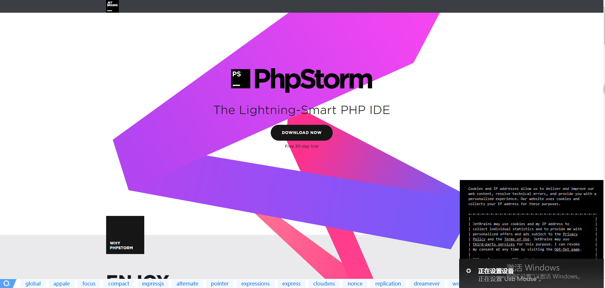

## 关于下载安装PhpStorm和XAMPP

####[官网链接](https://www.jetbrains.com/phpstorm/promo/?utm_source=baidu&utm_medium=cpc&utm_campaign=cn-bai-br-phpstorm-ex-pc&utm_content=phpstorm-prue&utm_term=phpstorm&utm_expid=.0seJaOyOQaiq1VcBRgz35A.1&utm_referrer=https%3A%2F%2Fwww.baidu.com%2Fbaidu.php%3Fsc.Kf0000Ks1acltSXAQRpnSCqFClH9_4hO1162S_7_OZItAfTg4A75yyxhfIEDGBo96azb4w13znNe1-0XlzjPejCW31OX9puILlFjZR9Lv_ahiHnY1t3sEnZHctJKqEMYPnYwBizTAFlTeQ5mKJjTkRQgsdcRC2MtfrWpGPKrEfudH2fMlavEl4X665Du2NFNw5zgGbjGDmCkEQH--0.DY_NR2Ar5Od663rj6t_Jp7t1Q3CYfTPRAroZZfIPG6WkG9X1wW6kdm3ljGVnAroZZfIPG4qt7jHzk8sHfGmEukmr8a9G4I2UM3PQDrrZo6CpXy7MHWuxJBm9B1L_E1L1utIyrr6lUHMHYutT5gKfYt_QCJamJjAroZZfIPG134_aX8a9G4pauVQAroZZfIPGRojPakkLqrOBC0.U1Yk0ZDqTA9sTLwEThY0TA-W5H00IjdspZK1IAqzUfKGUHYznjf0u1dhuy4Mmv99UdqGTZmv0ZNG5yF9pywd0ZKGujY1nsKWpyfqPjn10AdY5HDsnH-xnH0kPdtknjfv0AVG5H00TMfqPjm40ANGujYzrHm1P7tkPjfdg1cknj6vg1c4PHc1g1c4PHcsg1c4P1csg1c4PHmLg1c4nWckg1cznHRL0AFG5HDdr7tznjf0UynqnH0snNtkrjnYn16LnHnvg1csn16krHRkP1T0TgKGujYs0Z7Wpyfqn0KzuLw9u1Ys0A7B5HKxn0K-ThTqn0KsTjYs0A4vTjYsQW0snj0snj0s0AdYTjYs0AwbUL0qn0KzpWYs0Aw-IWdsmsKhIjYs0ZKC5H00ULnqn0KBI1Ykn0K8IjYs0ZPl5fK9TdqGuAnqTZnVuLGCXZb0pywW5R9rffKYIgnqnHmkPjf1njfznHmLnHmvrj0znjf0ThNkIjYkPHm3n1RsrH0YPjDY0ZPGujd-PvPBnhNBPj0snj-BryPb0AP1UHdjfWf1fYRkfHb3nYc1PY7A0A7W5HD0TA3qn0KkUgfqn0KkUgnqn0KlIjYs0AdWgvuzUvYqn7tsg100uA78IyF-gLK_my4GuZnqn7tsg100TA7Ygvu_myTqn0Kbmv-b5H00ugwGujYVnfK9TLKWm1Ys0ZNspy4Wm1Ys0Z7VuWYkP6KhmLNY5H00XMK_Ignqn0K9uAu_myTqnfK_uhnqn0KEIjYs0AqzTZfqnanscznsc10WnansQW0snj0snansczns0APzm1YznWczPf%26word%3Dphpstorm%26ck%3D3965.7.226.334.177.585.225.1129%26shh%3Dwww.baidu.com%26sht%3Dbaidu%26us%3D1.0.1.0.1.300.0%26bc%3D110101)    

**点击下载**

 **下载完成点击下载在文件夹中的内容**

**点击之后**

**点击next**

**安装完成之后打开PhpStorm**

**JetBrains开发工具免费提供学生和教师使用取得授权后只需要使用相同的
JetBrains 帐号就可以激活其他产品，不需要重复申请**

关于学校邮箱的信息

[邮件地址](http://mail.cqupt.edu.cn)

学生邮件系统为学生自动分配邮箱地址，邮箱地址为  学号@stu.cqupt.edu.cn,

初始密码为Cqupt.+身份证后六位

首次登陆厚系统会要求重新设置密码，密码包括大写字母，小写字母和数字，长度不小于6位

**申请账号**

首先进入  https://www.jetbrains.com/shop/eform/students

**然后才看你的学生邮箱，你将收到一份邮件**

**之后你将收到封邮件确认的账号**

**一切就绪之后就可以输入账号激活了**

**在代码跑起来之前还的在安装一个东西  xampp**

[官网链接](https://www.apachefriends.org/index.html)

**下载完成结果**

**点击安装**

**安装此物没有太多注意，一路next即可，唯一之一的可能是你的安装路径上**

**完成之后还需要再PhpStorm中配置一下即可**

点击file 选择Setting

运行也可以选择右上方几个浏览器小图标，应当选择可以以安装的浏览器，点击后就会在浏览器上输出hello world

